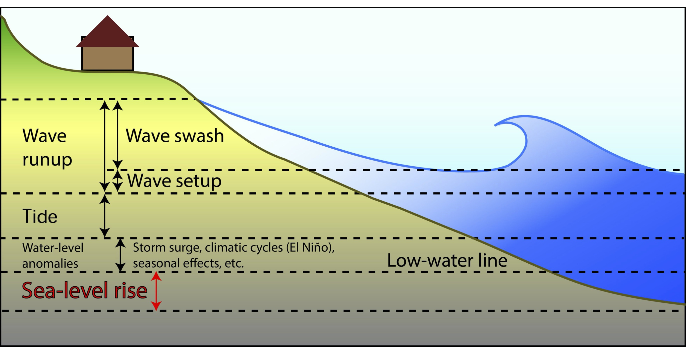
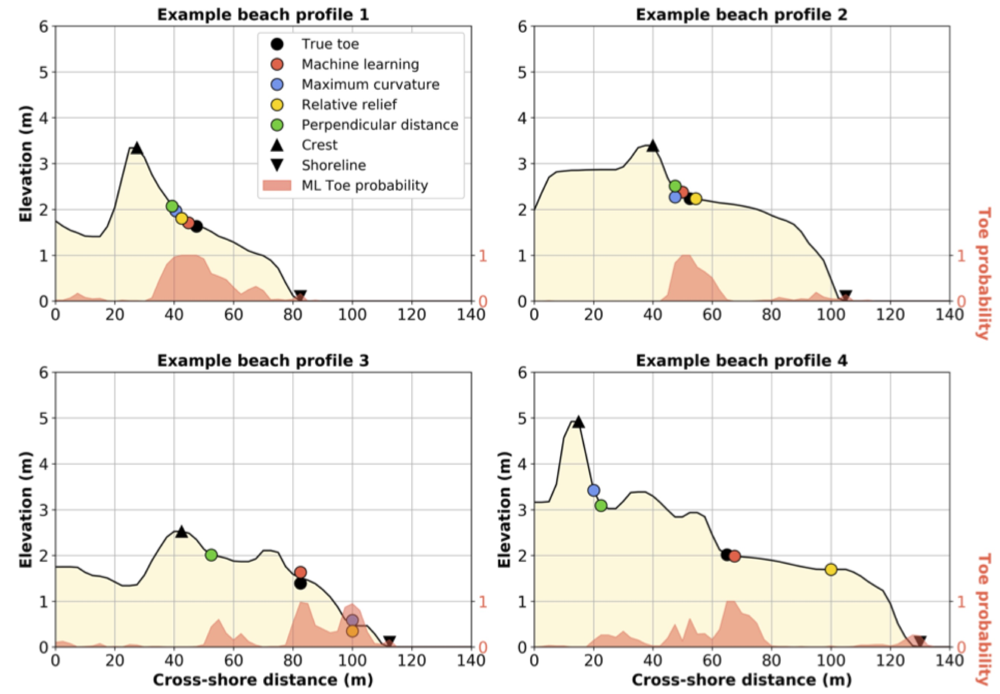
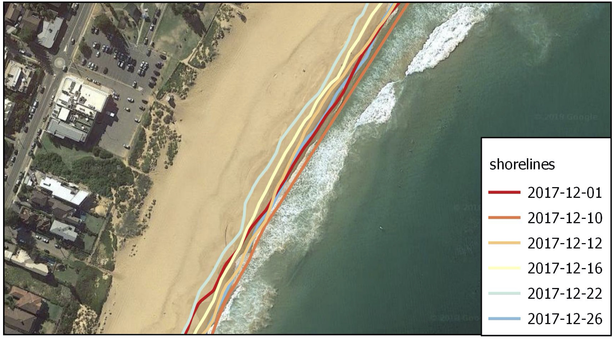
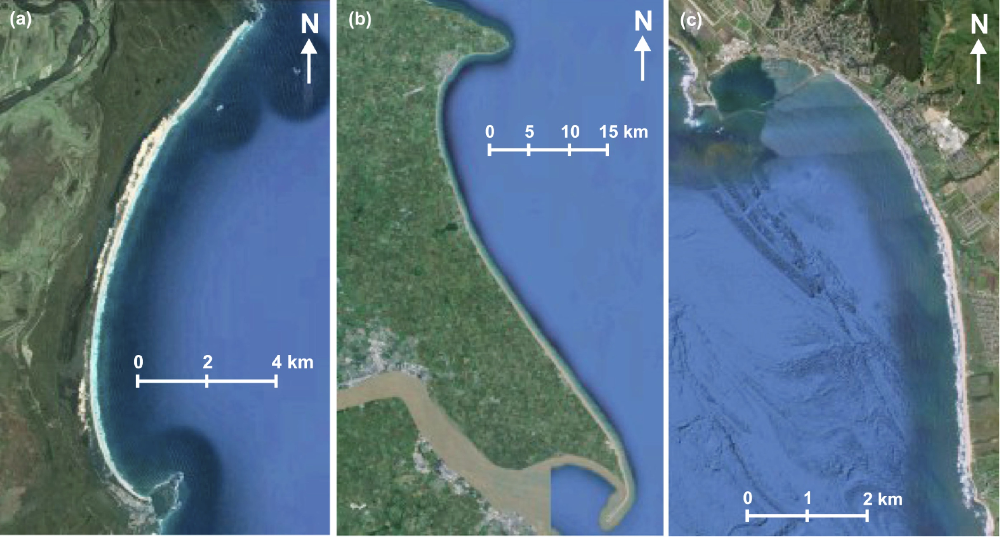
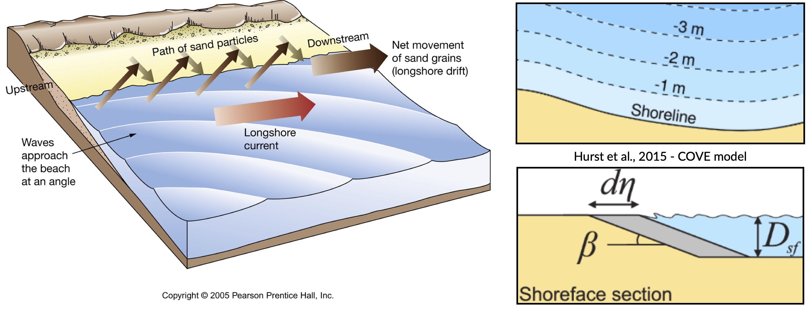
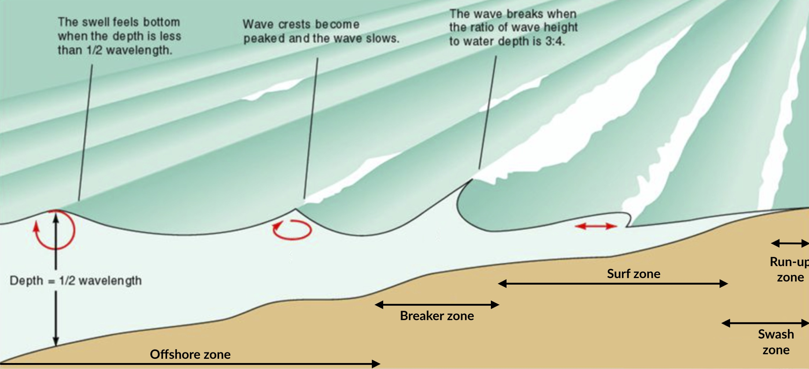
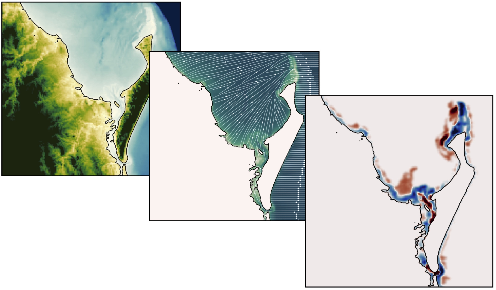

Quantifying coastal changes
============================

..  admonition:: Chapter content
    :class: toggle, important, toggle-shown

    In this chapter, you will investigate nearshore to beach processes from wave run-up to beach profiles. You will also look at different numerical approaches to analyse shoreline changes.

    .. raw:: html

        

        <iframe width="100%" height="350" src="https://www.youtube.com/embed/u5VBADNI_es?rel=0" frameborder="0" allow="accelerometer; autoplay; encrypted-media; gyroscope; picture-in-picture" allowfullscreen></iframe>
        

Context
-------------------------------

Small changes in the magnitude or direction of storm waves have the ability to profoundly disturb our coastlines by modifying beach stability and enhancing coastal erosion.

The coastal region is the most heavily urbanised land zone in the world and is regarded as a critical resource in view of its recreational, environmental and economic importance.

.. note::

  Ocean coasts are affected by variations in mean sea level, extreme waves, storm surges and river flow through a range of physical processes. Recent intensification in mean wave energy, extreme coastal wave energy and oceanic wind speeds, coupled with rising sea levels, suggest that coastal areas will be exposed to increasing hazards in coming decades. It is therefore critical to observe and quantify changes along coastlines vulnerable to extreme as well as subtle changes in oceanographic forcing.

Nearshore and beach processes
-------------------------------

In this video, we will first look at the mechanisms that influences nearshore environments especially we will discuss the different temporal and spatial scales involved. Then, we will analyse which processes become dominant as waves propagate from offshore towards the coast. Finally, we will have a quick introduction to the existing models that can be used to simulate these processes.

.. raw:: html

    

    <iframe width="100%" height="350" src="https://www.youtube.com/embed/bbyb8OATcow?rel=0" frameborder="0" allow="accelerometer; autoplay; encrypted-media; gyroscope; picture-in-picture" allowfullscreen></iframe>
    

Wave runup
**************

**Wave runup** refers to the final part of a wave's journey as it travels from offshore onto the beach. It is observable by anyone who goes to the beach and watches the edge of the water *runup* and *rundown* the beach. It is comprised of two components:

* **setup**: the height of the time averaged superelevation of the mean water level above the Still Water Level (**SWL**)
* **swash**: the height of the time varying fluctuation of the instantaneous water level about the setup elevation

Setup, swash and other components of Total Water Level (**TWL**) rise are shown in this handy figure below from `Vitousek et al. (2017) <https://www.nature.com/articles/s41598-017-01362-7>`_.

  The water-level components that contribute to coastal flooding from Vitousek et al. (2017).

Wave runup can contribute a significant portion of the increase in TWL in coastal storms causing erosion and inundation. For example, `Stockdon et al. (2006) <https://doi.org/10.1016/j.coastaleng.2005.12.005>`_ collated data from numerous experiments, some of which showed wave runup 2% excedence heights in excess of 3 m during some storms.

Given the impact such a large increase in TWL can have on coastlines, there has been much research conducted to try improve our understanding of wave runup processes.

.. note::
  Although there are many processes which can influence wave runup (such as nonlinear wave transformation, wave reflection, three-dimensional effects, porosity, roughness, permeability and groundwater), **many attempts have been made to derive empirical relationships based on easily measurable parameters**.

Typically, empirical wave runup models include:

* :math:`H_{s}`: significant wave height
* :math:`T_{p}`: peak wave length
* :math:`\beta`: beach slope

The **py-wave-runup** (`here <https://github.com/chrisleaman/py-wave-runup>`_) is a Python package that implements different published wave runup empirical models based on :math:`H_{s}`, :math:`T_{p}`, and :math:`\beta`.

..  admonition:: Wave runup models from the py-wave-runup model
    :class: toggle, important

    .. raw:: html

      

      <iframe width="100%" height="550" src="https://py-wave-runup.readthedocs.io/en/latest/models.html?rel=0#module-models" frameborder="0" allow="accelerometer; autoplay; encrypted-media; gyroscope; picture-in-picture" allowfullscreen></iframe>
      

Using **py-wave-runup** , we will evaluate the accuracy of the `Stockdon et al. (2006) <https://doi.org/10.1016/j.coastaleng.2005.12.005>`_ runup
model. To do this, we will use the compiled wave runup observations provided by `Power
et al (2018) <https://doi.org/10.1016/j.coastaleng.2018.10.006>`_.

The Stockdon et al (2006) wave runup model comprises of two relationships, one for
dissipative beaches (*i.e.* Iribarren number :math:`\zeta < 0.3`):

.. math::
  R_{2} = 0.043(H_{s}L_{p})^{0.5}

and a seperate relationship for intermediate and reflective beaches (*i.e.* Iribarren number
:math:`\zeta > 0.3`):

.. math::
  R_{2} = 1.1 \left( 0.35 \beta (H_{s}L_{p})^{0.5} + \frac{H_{s}L_{p}(
    0.563 \beta^{2} +0.004)^{0.5}}{2} \right)

..  admonition:: **Jupyter Notebooks**
    :class: toggle, toggle-shown

    .. image:: https://mybinder.org/badge_logo.svg
      :target: https://mybinder.org/v2/gh/TristanSalles/CoastProc/binder?urlpath=tree/Notebooks/notebooks/BeachProcesses/WaveRunUp.ipynb

    Click on the above button to assess 2 runup models.

    .. image:: https://mybinder.org/badge_logo.svg
      :target: https://mybinder.org/v2/gh/TristanSalles/CoastProc/binder?urlpath=tree/Notebooks/notebooks/BeachProcesses/RunUpDataset.ipynb

    Evaluate wave runup observations against the Iribarren number with the above link.

Beach profiles
********************

Sandy coastlines typically comprise two key parts: a **beach** and **dune**.

.. note::

  The **beach** is the section of sandy coast that is *mostly above water* (depending upon tide) and actively influenced by *waves*, while **dunes** are elevated mounds/ridges of sand at the *back of the beach*.

The interface between the beach and dune is often *characterised by a distinct change in ground slope* (with the dune having a steeper slope than the beach). Dunes are particularly important along sandy coastlines because they provide a natural barrier to coastal hazards such as storm-induced waves and surge. The capacity of sandy dunes to provide coastal hazard protection depends in large part on their geometry.

.. important::

  The location of the **dune toe** (the transition point between the beach and dune) is a key factor used in coastal erosion models and for assessing coastal vulnerability to hazards (`Sallenger, 2000 <https://journals.flvc.org/jcr/article/view/80902>`_).

Domain experts are generally able to identify the location of the dune toe given a 2D beach profile. However, recent improvements in coastal monitoring technologies (such as optical, Lidar, and satellite remote sensing), have resulted in a significant increase in coastal topographic data, for which analysis by an expert is infeasible. As a result, there has been increased need for reliable and efficient algorithms for extracting important features such as dune toes from these large coastal datasets.

There are many different algorithms currently available for automatically detecting the dune toe on 2D cross-shore beach profiles:

1. **Maximum curvature** (`Stockdon et al., 2007 <https://www.sciencedirect.com/science/article/pii/S0025322706003355?via%3Dihub>`_) - the dune toe is defined as the location of maximum slope change;
2. **Relative relief** (`Wernette et al. 2016 <https://www.sciencedirect.com/science/article/pii/S0169555X16300630?via%3Dihub>`_) - the dune toe is defined based on relative relief (the ratio of local morphology to computational scale);
3. **Perpendicular distance** - the dune toe is defined as the point of maximum perpendicular distance from the straight line drawn between the dune crest and shoreline; and,
4. **Machine learning** (ML) using Random Forest classification.

  Example applications of pybeach.

..  admonition:: Locating the dune toe using Machine Learning
    :class: toggle, important

    As shown in the figure above using **pybeach** code from `Beuzen <https://github.com/TomasBeuzen/pybeach>`_ the performance of these algorithms in extracting dune toe locations on beach profiles varies significantly.  While experts can generally identify the dune toe on a beach profile, it is difficult to develop an algorithm that can consistently and reliably define the dune toe for the large variety of beach profile shapes encountered in nature.

    In such cases, the use of machine learning (ML) can help improving toe detection. It consists in *feeding* the ML algorithm with existing dataset. In **pybeach** three pre-trained ML models are provided:

    1. a **barrier-island** model. This model was developed using 1046 pre- and post- “Hurricane Ivan” airborne LIDAR profiles from Santa-Rosa Island Florida (this data was collected in 2004);
    2. a **wave-embayed** model. This model was developed using 1768 pre- and post- “June 2016 storm” airborne LIDAR profiles from the wave-dominated, embayed southeast Australian coastline (this data was collected in 2016).
    3. a **mixed** model. Developed using a combination of the two above datasets.

    For each dataset described above, the true location of the dune toe on each individual profile transect was manually identified and quality checked by multiple experts and verified using satellite imagery, digital elevation models and/or in-situ observations where available. This resulted in the best possible data to facilitate the creation of the ML models in **pybeach**.

    .. image:: https://mybinder.org/badge_logo.svg
      :target: https://mybinder.org/v2/gh/TristanSalles/CoastProc/binder?urlpath=tree/Notebooks/notebooks/BeachProcesses/pyBeach.ipynb

    With the above link, you will have a look at how **pybeach** could be used to locate the dune toe on cross-shore beach profile transects.

Coastline evolution
----------------------

.. raw:: html

    

    <iframe width="100%" height="350" src="https://www.youtube.com/embed/9s9kkQu2JZg?rel=0" frameborder="0" allow="accelerometer; autoplay; encrypted-media; gyroscope; picture-in-picture" allowfullscreen></iframe>
    

Analysing shoreline changes
***********************************

Space-borne observations have been employed in a wide range of change detection applications, including the analysis of meandering river morphodynamics, delineation of wetland footprints and identification of oil spills.

.. note::
  Recently, optical imaging satellites have begun to be used to measure the location of the shoreline, which is regarded by coastal managers, planners, engineers and scientists as a key indicator of how coastlines vary and evolve over time.

Nowadays, it is possible to use image composites from satellites to map the position of the shoreline with a horizontal accuracy of the order of half a pixel (i.e., **15 m** for Landsat images and **5 m** for Sentinel-2 images).  Some studies have even managed to detect  shoreline at a sub-pixel resolution technique in low-energy microtidal beach and reported horizontal accuracies of less than 10 m using Landsat 7, Landsat 8 and Sentinel-2 images.

.. important::
  Satellite remote sensing can provide low-cost long-term shoreline data capable of analysing multi-decadal temporal changes relevant to coastal scientists and engineers at sites where no in-situ field measurements are available.

`CoastSat <https://github.com/kvos/CoastSat>`_ is an example of such open-source package developed at the Water Research Laboratory in Manly that can be used to obtain time-series of shoreline position at any coastline worldwide from 30+ years (and growing) of publicly available satellite imagery.

It enables the non-expert user to extract shorelines from Landsat 5, Landsat 7, Landsat 8 and Sentinel-2 images. The shoreline detection algorithm implemented in **CoastSat** is optimised for sandy beach coastlines. It combines a sub-pixel border segmentation and an image classification component, which refines the segmentation into four distinct categories such that the shoreline detection is specific to the sand/water interface.

.. raw:: html

    

    <iframe width="100%" height="450" src="https://www.youtube.com/embed/YK_d08BHids?rel=0" frameborder="0" allow="accelerometer; autoplay; encrypted-media; gyroscope; picture-in-picture" allowfullscreen></iframe>
    

The toolbox has three main functionalities:

1. assisted retrieval from Google Earth Engine of all available satellite images spanning the user-defined region of interest and time period.
2. automated extraction of shorelines from all the selected images using a sub-pixel resolution technique
3. intersection of the 2D shorelines with user-defined shore-normal transects

Embayed beaches
******************

The curved planform morphology of embayed beaches can be observed at various length-scales at coastlines, from a few hundred meters to several kilometers. These bays occur in the lee of headlands or man-made coastal structures where erosion and/or littoral drift is inhibited in the face of a dominant direction of wave incidence `(Hurst et al., 2015) <http://onlinelibrary.wiley.com/doi/10.1002/2015JF003704/abstract>`_. A highly concave portion of shoreline forms on the down-drift side of the headland where the coastline is shadowed from the dominant wave direction and subject to waves that diffract around the headland.

Examples of crenulated bay shapes at different scales from `Hurst et al. (2015) <http://onlinelibrary.wiley.com/doi/10.1002/2015JF003704/abstract>`_: *(a) Hathead Bay, Eastern Australia. (b) Flamborough Head and the Holderness Coastline, East Yorkshire, UK. (c) Half Moon Bay, California, USA*.

Embayed beaches tend toward an equilibrium form under a prevailing wave climate. The planform morphology will adjust until gradients in alongshore sediment flux are minimised (net alongshore sediment flux is constant). Alongshore sediment flux will be negligible on an equilibrium coastline when there are no external sediment inputs. Subsequent changes in planform morphology may occur such as beach rotation, driven by changes in wave climate characteristics that alter alongshore sediment transport.

.. note::
  One-line models of shoreline evolution can reproduce embayed beach morphology in the lee of a headland or promontory. They are based on simple rules to describe the adjustment in wave height and direction due to diffraction in the shadow of a promontory and demonstrated that the resulting bay forms were similar in form to a logarithmic spiral.

In one-line models, the shoreline is represented by a single line (or contour) that advances or retreats depending on the net alongshore sediment flux. One-line models make a number of simplifying assumptions to conceptualise the coastline allowing the ‘one-line’ representation of the coastline:

1. Short-term cross-shore variations due to storms or rip currents are considered temporary perturbations to the long-term trajectory of coastal change (i.e. the shoreface recovers rapidly from storm-driven cross-shore transport).
2. The beach profile is thus assumed to maintain a constant time-averaged form, implying that depth contours are shore-parallel and therefore allows the coast to be represented by a single contour line (right panels in top figure).
3. Alongshore sediment transport occurs primarily in the surf zone, and cross-shore sediment transport acts to maintain the equilibrium shoreface as it advances /retreats.
4. Alongshore sediment flux occurs due to wave action in the surf zone, parameterized by the height and angle of incidence of breaking waves. Gradients in alongshore transport dictate whether the shoreline advances or retreats.

Bulk alongshore sediment flux is driven by waves breaking on the shoreface. Typically in alongshore transport laws, flux depends on the height :math:`H_b` and angle :math:`\alpha_b` of breaking waves. For example, the CERC equation is given by:

 .. math::
    Q_{ls} = K_{ls} H_b^{5/2} sin(2\alpha_b)

where :math:`K_{ls}` is a transport coefficient. The transport coefficient :math:`K_{ls}` may be modified to account for the size of beach material (:math:`D_{50}`). Calibration of this coefficient can be made from estimates of bulk alongshore transport or by calibration against a historical record of coastal change (*e.g.* `Barkwith et al. (2014) <http://www.earth-surf-dynam.net/2/295/2014/esurf-2-295-2014.html>`_).

Regional scale models
*************************

Many complex models exist to evaluate the complex interactions between ocean hydrodynamics and sediment transport like `XBeach <http://oss.deltares.nl/web/xbeach/>`_, `ROMS <https://www.myroms.org>`_, `Delft3d <https://oss.deltares.nl/web/delft3d>`_, `FVCOM <http://fvcom.smast.umassd.edu>`_ to cite a few.

As an example, the nearshore wave propagation model `XBeach <http://oss.deltares.nl/web/xbeach/>`_ solves coupled 2D horizontal equations for wave propagation, flow, sediment transport and bottom changes, for varying (spectral) wave and flow boundary conditions. It is a public-domain model that can be used as stand-alone model for small-scale (project-scale) coastal applications, but could also be integrated within more complex coupling frameworks. For example, it could be driven by boundary conditions provided by wind, wave or surge models and its main outputs (time-varying bathymetry and possibly discharges over breached barrier island sections) could be then transferred back.

Here we will look at a more simple approach based on a **reduced complexity model** that adopts the most basic known principles of wave motion, *i.e.*, the linear wave theory (Airy derived `wave parameters description <https://en.wikipedia.org/wiki/Airy_wave_theory>`_). Wave celerity :math:`c` is governed by:

.. math::
  c = \sqrt{\frac{g}{\kappa} tanh \, \kappa d}

where :math:`g` is the gravitational acceleration, :math:`\kappa` the radian wave number (equal to :math:`2\pi/L`, with :math:`L` the wave length), and :math:`d` is the water depth.

In deep water, the celerity is dependent only on wave length :math:`\sqrt{gL/2\pi}`; in shallow water, it depends on depth (:math:`\sqrt{gd}`).

From wave celerity and wave length, we calculate wave front propagation (including refraction) based on a **Huygens-principle** method.

.. raw:: html

    

    <iframe width="100%" height="350" src="https://www.youtube.com/embed/KvOJ0o6Eqw4?rel=0" frameborder="0" allow="accelerometer; autoplay; encrypted-media; gyroscope; picture-in-picture" allowfullscreen></iframe>
    

From this, we deduce the wave travel time and define main wave-induced current directions from lines perpendicular to the wave front. Wave height is then calculated along wave front propagation. The algorithm takes into account wave energy dissipation in shallow environment as well as wave-breaking conditions.

As mentioned above, shoaling and refraction are accounted for from a series of deep-water wave conditions through time in the absence of wind forcing. Hence to compute wave field generation, the model requires **bathymetric conditions** and definitions of offshore significant **wave height**, characteristic **period**, and wave **direction**.

.. note::
  To evaluate marine sediment transport over several thousands of years, the approach taken here does not examine temporal evolving wave fields, such as those produced during storm events and relies on stationary representation of prevailing fair-weather wave conditions. The wave transformation model is generally performed for time intervals varying from 5 to 50 years.

The model simulates realistic wave fields by imposing a sequence of wave forcing conditions. At any given time interval, we define a percentage of activity for each deep-water wave conditions and the bathymetry is used to compute associated wave parameters.

To simulate wave-induced sediment transport, it is necessary to model the **water movement near the bottom**. The wave height :math:`H` and the wave period :math:`T` govern the maximum wave-orbital speed :math:`u_{w,b}` at the bed at any given depth and is expressed using the **linear wave theory** as:

.. math::
  u_{w,b} = \frac{\pi H}{T sinh \kappa d}

assuming the linear shallow water approximation (Soulsby), the expression is further simplified as:

.. math::
  u_{w,b} = (H/2) \sqrt{g/d}

Under pure waves (*i.e.*, no superimposed current), the wave-induced bed shear stress :math:`\tau_{w}` is typically defined as a quadratic bottom friction:

.. math::
  \tau_{w} = \frac{1}{2} \rho f_w u_{w,b}^2

with :math:`rho` the water density and :math:`f_w` is the wave friction factor. Considering that the wave friction factor is only dependent of the bed roughness :math:`k_b` relative to the wave-orbital semi-excursion at the bed :math:`A_b` (Soulsby), we define:

.. math::
  f_{w} = 1.39 (A_b/k_b)^{-0.52}

where :math:`A_b = u_{w,b}T/2\pi` and :math:`k_b = 2\pi d_{50}/12`, with :math:`d_{50}` median sediment grain-size at the bed.

For each forcing conditions, the wave transformation model computes and returns:

* the significant wave height,
* the mean wave direction and
* the shear stress induced by the maxima of the orbital velocity near the bottom.

These parameters are subsequently used to evaluate the **long-term sediment transport** active over the simulated region.

.. image:: images/wavesed1.jpg
  :scale: 25 %
  :alt: nearshore
  :align: center

In nearshore environments, longshore current runs parallel to the shore and is generated by the radiation stresses associated with the breaking process from obliquely incoming waves and by the surplus water which is carried across the breaker zone towards the shoreline `(Hurst et al., 2015) <http://onlinelibrary.wiley.com/doi/10.1002/2015JF003704/abstract>`_. This current significantly contributes to sediment transport in nearshore waters.

Following Komar, the longshore current velocity (:math:`\vec{v_l}`) in the middle of the breaking zone is defined by:

.. math::
  \vec{v_l} = \kappa_l u_{w,b} cos(\theta) sin(\theta) \vec{k}

with :math:`\theta` the angle of incidence of the incoming waves, :math:`\kappa_l` a scaling parameter and :math:`\vec{k}` the unit vector parallel to the breaking depth contour.

For wave rays approaching shallow regions at on oblique angle, the component of wave energy flux parallel to the shore will drives this longshore velocity. The calculation of the angle of incidence is deduced from bathymetric contour and wave directions (obtained from the wave transformation model) and requires an estimate of wave breaking depth (user defined parameter *wavebase*).

From the definition of bed sediment mean grain size, the adimensional particle parameter :math:`d_\star` is first derived:

.. math::
  d_\star = d_{50} \left[ \left( s-1 \right) \frac{g}{\nu^2} \right]^{1/3}

where :math:`s=\rho_s/\rho` is the relative density and :math:`\nu` the kinematic viscosity. Then the threshold Shields parameter :math:`\theta_c` is calculated based on Van Rijn formulation.

.. math::
  \begin{cases}
  \theta_c = 0.24/d_\star & \text{if } \theta_c \leq 4\\
  \theta_c = 0.14 d_\star^{-0.64} & \text{if } 10 \geq \theta_c > 4\\
  \theta_c = 0.04 d_\star^{-0.1} & \text{if } 20 \geq \theta_c > 10\\
  \theta_c = 0.013 d_\star^{0.29} & \text{if } 150 \geq \theta_c > 20\\
  \theta_c = 0.055 & \text{if } \theta_c > 150
  \end{cases}

In regions where wave-induced shear stress is greater than the critical shear stress derived from the Shields parameter (:math:`\tau_c = \theta_c gd_{50}(\rho_s-\rho_w)`), bed sediments are entrained. The erosion thickness :math:`h_e` is limited to the top sedimentary layer and for simplicity is assumed to follow a logarithmic form:

.. math::
  h_e = C_e \ln(\tau_w/\tau_c) \textrm{ where } \tau_w > \tau_c

where :math:`C_e` is an entrainment coefficient controlling the relationship between shear stress and erosion rate. Once entrained, sediments are transported following the direction of longshore currents and are deposited in regions where wave shear stress is lower than the critical shear stress for entrainment.

Marine sediments are further mobilised by a diffusion law similar to the one referred to as soil creep in the aerial domain to simulate long-term sediment dispersal induced by slope.

.. image:: https://mybinder.org/badge_logo.svg
  :target: https://mybinder.org/v2/gh/TristanSalles/CoastProc/binder?urlpath=tree/Notebooks/notebooks/LongTerm/SedTransport.ipynb

Exercise for the practical
----------------------------

Through the exercises and practicals, you will use beach survey program to evaluate long term changes in shoreline trajectory and run long-shore drift models to evaluate the impact of wave height and direction on embayed beaches morphologies.

.. image:: https://mybinder.org/badge_logo.svg
  :target: https://mybinder.org/v2/gh/TristanSalles/CoastProc/binder?urlpath=tree/Notebooks/notebooks/CoastalEvolution/selectProfiles.ipynb

Sensitivities of crenulate bay shorelines to wave climates.

.. image:: https://mybinder.org/badge_logo.svg
  :target: https://mybinder.org/v2/gh/TristanSalles/CoastProc/binder?urlpath=tree/Notebooks/notebooks/CoastalEvolution/selectProfiles.ipynb

Analyse Narrabeen Beach Profile Adjustment.

.. image:: https://mybinder.org/badge_logo.svg
  :target: https://mybinder.org/v2/gh/TristanSalles/CoastProc/binder?urlpath=tree/Notebooks/notebooks/CoastalEvolution/InshoreWaves.ipynb

Extracting nearshore waves from the Narrabeen dataset.

Additional
----------------

Grain settling velocity
***********************************

.. image:: https://mybinder.org/badge_logo.svg
  :target: https://mybinder.org/v2/gh/TristanSalles/CoastProc/binder?urlpath=tree/Notebooks/notebooks/BeachProcesses/GrainSettling.ipynb

Grain settling is one of the most important problems in sedimentology (and therefore marine processes modelling), as neither sediment transport nor deposition can be understood and modelled without knowing what is the **settling velocity** of a particle of a certain grain size.
