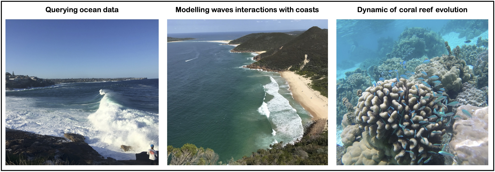

.. CoastProc documentation master file, created by
   sphinx-quickstart on Fri May 10 16:22:41 2019.
   You can adapt this file completely to your liking, but it should at least
   contain the root `toctree` directive.

Coastal Processes, Environments & Systems
=============================================

.. image:: https://readthedocs.org/projects/coastproc/badge/?version=latest
  :target: https://coastproc.readthedocs.io/en/latest/?badge=latest
  :alt: Documentation Status

This part of the course focuses on coastal system analysis using both *data* & *models*.

The emphasise will be on:

* **What is a model?**
* **How to analyse numerical and ocean data?**
* **How to run different types of model?**

Numerical modelling is a widely applied technique to tackle complex coastal problems. It uses mathematical models to describe the physical conditions of natural systems using numbers and equations.

With *numerical models*, scientists can use physical methods to approximate the solutions of many natural processes. Numerical experiments can then be performed, yielding the results that can be interpreted in the context of coastal processes.
Both **qualitative** and **quantitative** understanding of a variety of marine environments and processes can be developed via these experiments.

Over the last 50 years, major improvements in our understanding of coastal processes have been related to both physical and numerical modelling. Detail evaluation of any of these techniques require strong mathematical background and several years of study in specialised fields. Therefore the goal of this section of the course is more on an overview of the type of models that are used and to focus on few of the basic principles underlying these models.

Lecture notes content
*****

.. important::
  During lectures we will be using computer-based modelling and you will need to bring an electronic device (preferably a laptop or a tablet or phone with internet access). As there will be a lot to cover, it is also recommended to go through each chapter prior to the lecture to be well prepared and able to get the most of it during classes.

Contents
--------

.. toctree::
   method
   installation
   usage
   social
   CoastProc
   :maxdepth: 3

Indices and tables
------------------

* :ref:`genindex`
* :ref:`modindex`
* :ref:`search`
