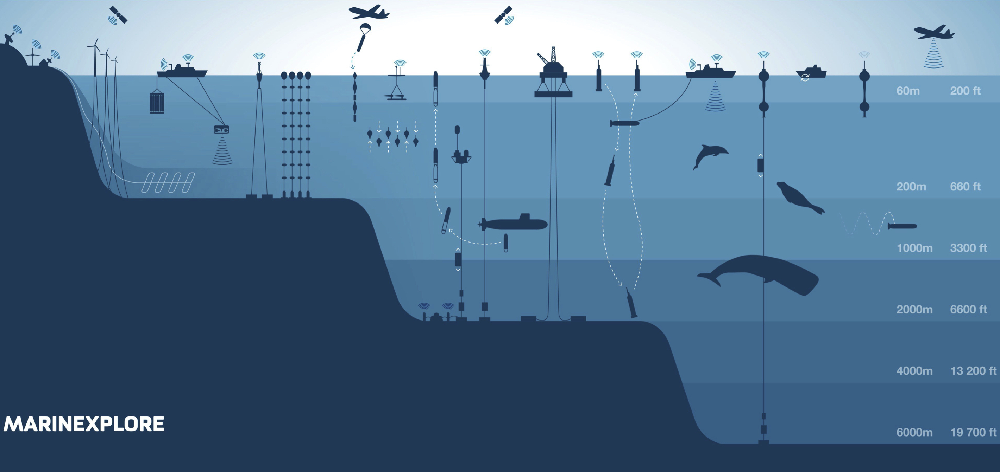
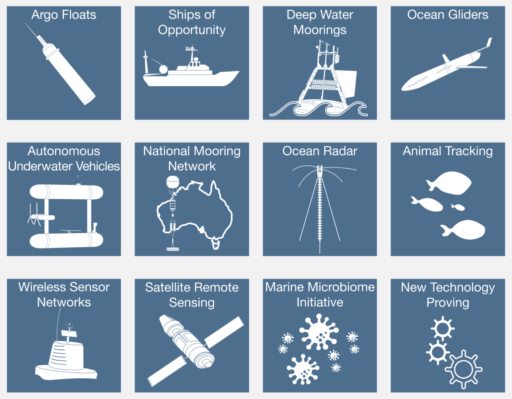

Ocean data query
=================

Coastal Ocean Observing Systems
-----------

The ocean plays a role in everyone’s life. It affects weather and climate patterns around the globe, hosts an abundance of wildlife that support fishing industries and provide food for the world, serves as a highway for vessels that deliver everyday materials, and supports economies as a tourism destination.

The coastal ocean is the part of the earth system where land, water, air, and people meet together. Populations, businesses, and infrastructure are increasing along coastlines, which are all susceptible to changing coastal ocean conditions.

.. tip::
  Now, more than ever, there is a need for regional to global observing systems that can provide accurate real-time data and forecasts on coastal ocean conditions.

**Coastal ocean observing systems** (COOS) are necessary for advancing our understanding on the state of the coastal ocean worldwide and its impact on matters of societal importance. These systems integrate a network of people, organisations, technologies, and data to share advances, improve research capabilities, and provide decision-makers with access to information and scientific interpretations.

.. important::
  Data, observations, and models integrated into the **COOS** come from a variety of platforms, including, for example, **moorings**, high-frequency (HF) **radars**, underwater **gliders** and profilers, **satellites**, and **ships**. The resulting data are used to better understand, respond to, and prepare for **short-term** events such as oil spills, harmful algal blooms, and fish kills, **longer term** changes in our oceans resulting in acidification, hypoxia, and sea level rise, and in everyday decisions related to maritime operations, public health, and management of healthy ecosystems.

Why do we need ocean observing tools?
*****

Until recently, the ocean was viewed as *being an unlimited resource to be exploited* (source: *US National Academies of Science report on Economic Benefits of Oceanographic Research, 1964*).  Subsequent science, including that from national and international observing efforts, has changed what we know about the ocean.

Nowadays, we recognise that **the ocean is a finite and shared resource** that needs to be manage regionally, nationally, and worldwide.

There are a number of significant societal threats and challenges facing humans due to the changing ocean:

* The increased frequency and intensity of coastal storms and resulting storm surges will affect our coastal communities and disrupt commerce, nationwide.
* Sea level changes are threatening critical infrastructure worldwide.
* Harmful algal blooms and oxygen-deficient dead zones threaten water supplies, fisheries, and coastal recreation.
* Ocean acidification is negatively impacting coral reefs and shellfish harvesting.
* The increasing size and number of vessels calling on ports present challenges for our already inadequate maritime infrastructure, and pose potential environmental risks as well.
* The world’s growing population will increasingly rely on the ocean for food, but fishing must be done sustainably.

To be able to understand and manage the ocean, we need meaningful measures of the ocean’s state.

National & Global Ocean Observing Infrastructure
*****

Observing systems are expensive; Australia invests billions of dollars in civil Earth observations to ensure that the nation’s decision-makers and managers have the information they need about climate and weather, disaster events, land-use change, ecosystem health, natural resources, and many other characteristics of the planet.

The ocean is a harsh environment in which to operate an observing system, from corrosion due to salinity to bio-fouling. The costs of maintaining instrumentation in this environment, accessing remote locations, and establishing sufficient communications with deployed technologies are significant.

`IMOS <http://imos.org.au>`_ had as its prime focus improving scientific understanding of ocean conditions, but the information it generates is increasingly being used by government agencies and other users to inform decisions. The main activities of `IMOS <http://imos.org.au>`_ are based around:

* Deploying, maintaining, and developing advanced observations technologies
* Providing free and open access to data in support of a wide range of users
* Advancing modeling
* Focusing on education

In addition to providing observations and data to a large and growing number of research projects, student projects, and academic courses, `IMOS <http://imos.org.au>`_ is now recognised as an essential partner in large, multi-institutional research programs across multiple sectors. It has contributed to 180 postgraduate projects, over 400 journal publications, and 250 research projects.

Coastal ocean observing systems development
*****

Most large-scale coastal ocean observing systems are funded through national governments for their own interests, often with different foci, but the world’s oceans are connected, therefore partnering is the key to success. As an example, The U.S. Integrated Ocean Observing System (`IOOS <https://ioos.noaa.gov>_`), **Australia’s Integrated Marine Observing System** (`IMOS <http://imos.org.au>`_), or European Ocean Observing System (`EOOS <http://eurogoos.eu/eoos/>_`) are progressing in their respective regions and are working together to observe and compile ocean information in a way that is easily accessible to scientists and managers.

**IMOS** advances have benefited from an evolving set of ocean observing efforts. The envisioned concept was a coordinated national and international network of observations, data management, and analyses that systematically acquired and disseminated data and information on past, present, and future states of the oceans. The coastal ocean observing efforts are implemented via regional programs distributed around coastal regions.

Each program is designed to assess and predict the effects of weather, climate, and human activities on the state of the coastal ocean, its ecosystems and living resources, and on the world’s economy.

.. note::

  The Australian `IMOS <http://imos.org.au>`_ was formed in 2007, with equipment deployed from the next year onward. Scientific ’nodes’ were formed broadly around state boundaries with both nationally unified overarching science goals and local priorities. The **NSW-IMOS** is an example of a successfully implemented ocean observing system along the coast of southeastern Australia. The current observational array is designed around pertinent science questions, leveraged existing data streams, and opportunities for further oceanographic research.

`IMOS <http://imos.org.au/facilities/>`_ currently has a portfolio of **13 Facilities** that undertake systematic and sustained observing of Australia’s marine environment, across scales (from open ocean, onto the continental shelf, and into the coast), and across disciplines (physics, biogeochemistry, and biology and ecosystems).

Ocean observing technologies
-----------

It is a complex task to measure the ocean in ways that deliver useful products for people. For example, to deliver a five-day weather forecast for any local region, meteorologists must sample the whole planet. **Satellites** are key tools that provide multispectral images, atmospheric soundings, and sea surface characteristics needed for these forecasts. While satellites enable us to see through the atmosphere, they can only measure the surface of the ocean, and this does not provide the detail needed for accurate weather prediction. Therefore, we also need a complement of in situ measurements that extend our reach to the depths of the oceans at all relevant scales of phenomena. In situ refers to systems that measure on or under the surface of the ocean in continuous and event-driven modes, automatically and by humans.

`IMOS <http://imos.org.au>`_ is a global leader in ocean observation. It has infrastructures that operate on continental scales, field observing technologies, shares best practices for a broad suite of variables, and generate masses of data. `IMOS <http://imos.org.au>`_ is partner with `IOOS <https://ioos.noaa.gov>_` and `OTN <https://oceantrackingnetwork.org>_` (this later is a global ocean research and technology development platform, in the area of animal tagging and tracking). To understand animal movements and survival, you also have to understand how the animals respond to changes in environmental conditions. Thus, the animal tracking effort is tightly integrated with the observation of the physical and chemical environment, and all networks depend on common platforms for oceanographic observations. Other observing technologies include Argo, moored buoys, high-frequency radar (HFR), and autonomous underwater vehicles known as gliders.

Access to the data
*****

All the national systems that participate in the Global Ocean Observing System (`GOOS <https://www.goosocean.org>_`) and the Group on Earth Observations (`GEO <http://www.earthobservations.org/index.php>_`) subscribe to the principal of **free and open data**. It is **policy** within Australia that all observational data collected with governmental funding support are made freely and openly available, which makes sense from scientific, disaster response, and economic perspectives.

.. important::
  One challenge `IMOS <http://imos.org.au>`_ faces is the need to support operational systems, often with unique data formats, while simultaneously working to create mutually compatible data access systems and services, and common data formats and metadata standards, in order to facilitate access to this public resource through the internet.

`IMOS <http://imos.org.au>`_ provides marine data such as *temperature*, *salinity*, *currents*, *wind speed/direction*, *waves*, and other primarily physical observations for model assimilation through the GTS (Global Telecommunication System). For broader access, `IMOS <http://imos.org.au>`_ uses three standards to convey the information in an interoperable manner:

* Open-source Project for a Network Data Access Protocol (**OPeNDAP**),
* Sensor Observation Service (**SOS**) and Open Geospatial Consortium (**OGC**) Standard, and
* Web Map Services (**WMS**) OGC Standard.

.. raw:: html

      <iframe width="695" height="515"
      src="https://portal.aodn.org.au/search"
      frameborder="0" allowfullscreen></iframe>

Modeling and analysis
*****

Prediction of future conditions is critical to deliver the full benefits of an ocean observing system. The Australian ocean and coastal modeling community is a partnership between multiple universities and national organisations (CSIRO, IMOS, GA, BOM to cite a few) that is being asked to provide greater resolution models that cover not only traditional physical water circulation, which remains a critical need, but also expand outputs to include inundation forecasting and ecosystem modeling.

In May 2014, `IMOS <http://imos.org.au>`_ published the **IMOS Strategy 2015-25** (`source <http://imos.org.au/fileadmin/user_upload/shared/IMOS%20General/documents/IMOS/Plans___Reports/IMOS_Strategic_Plan_3Jun2014_low_res.pdf>_`). In this plan, one can read that:

.. note::
  `IMOS <http://imos.org.au>`_ has a concerted focus on making **data available** and **seeing that it is used**. `IMOS <http://imos.org.au>`_ has worked with the coastal modeling community to make sure that available data are informing numerical models. Going forward, `IMOS <http://imos.org.au>`_ will use its infrastructure to be a coordinating entity to advance the assimilation and further development of coastal modeling. `IMOS <http://imos.org.au>`_ has begun a structured engagement with the coastal and ocean modeling communities through development of joint products (e.g., in ocean reanalysis), national workshops, and targeted infrastructure investment at the model-data interface (such as virtual laboratories).

Summary
-----------

Working together, agencies like `IMOS <http://imos.org.au>`_ or `IOOS <https://ioos.noaa.gov>_` help to manage our oceans by measuring them and connecting observations to people. Yet, ocean observing systems are only as good as our ability to observe and accurately model ocean systems.

**Finding the resources to sustain coastal observations over relevant time scales is a big challenge**.

As a growing population continues to stress our planet, quality observations will increase in importance. But it is not good enough to measure the planet, we also need to work to ensure this information comes into play in our communities, our economies, and in management decisions.
