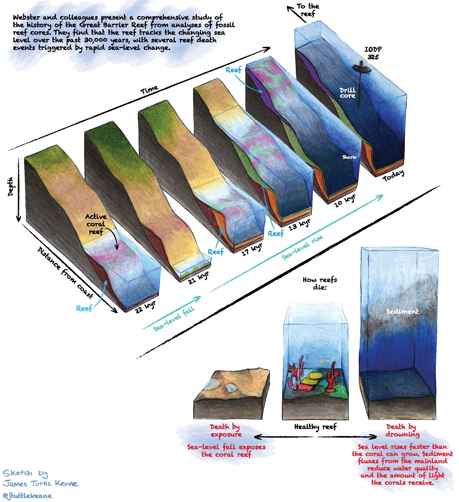
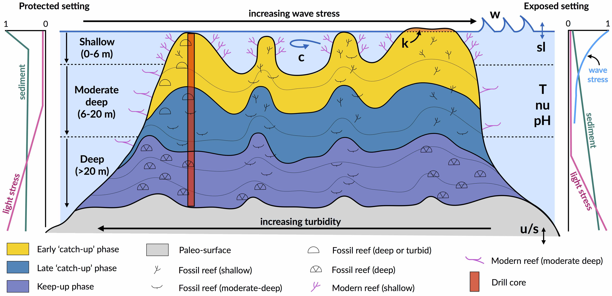
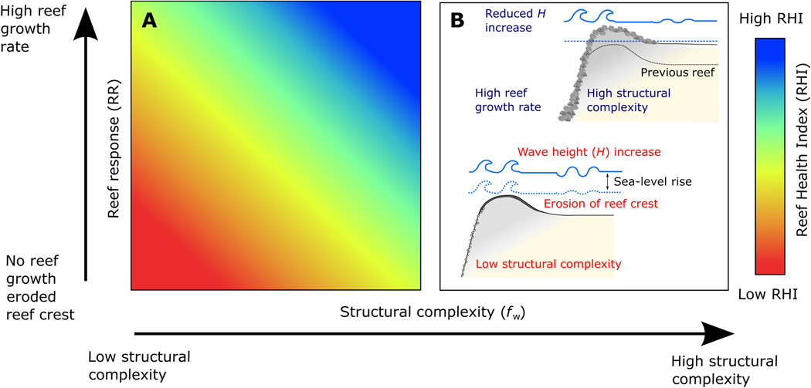

Coral reef evolution
=================

The Great Barrier Reef is the largest living organism on the planet, stretching over 2,600 kilometres in length and covering 344,400km2 of the ocean. It consists of 2,900 individual reefs and 900 islands.

The growth and evolution of the reef did not happen overnight. In fact, it is over 20 million years in the making. The reef as we know it today is built on the backs and bones of many millions of years of coral as the ocean levels have changed, islands have formed and land has settled.

.. note::
  The GBR that we know is about 6,000 to 8,000 years old and sits on the platform of a much older reef. The formation, location and depth have changed as the continental shelf and sea level have changed and will likely continue to do as sea levels change and the earth's crust shifts.

Amongst the approaches available to study coral reef platform formation, **Stratigraphic Forward Modelling** (SFM) has become a powerful tool. SFM simulates processes acting over geologic timescales and consists in iteratively refining parameters to improve the match between observed and predicted morphologies and stratigraphies. Through this iterative procedure, it helps to *evaluate* and *quantify* parameters that cannot be observed directly such as sedimentation or carbonate production rates. In that sense, SFMs address the short-comings of qualitative investigation techniques applied to carbonate systems.

Main physical forces acting on carbonate platform
-----------

Corals are calcium-carbonate-secreting, and their ability to grow and build reef structures is dependent upon favourable environmental conditions. Environmental factors affecting growth have been classified by `Veron (1995) <https://books.google.com.au/books/about/Corals_in_Space_and_Time.html?id=piQvtbFUicAC&redir_esc=y>`_ as **latitude-correlated** factors, and those that are **regional or local** in character.

tions and c currents), tectonic (u uplift and s subsidence), oceanic conditions (T temperature, nu nutrients, pH acidity), karstification (k) and sediment flux.
  :align: center

Latitude-correlated factors include sea surface temperatures (SSTs), solar radiation and water chemistry. These factors are likely to be affected most by climate change, potentially shifting the *optimal* environmental suitability for coral calcification toward the poles.

Regional and local environmental factors include wave climate, salinity, water clarity, nutrient influx, sedimentation regime and depth/composition of the initial substrate. These factors affect coral species to different extents, controlling the distribution of coral communities across a reef. Over longer time scales, they also shape the rate of calcium-carbonate production, framework building by corals, and the accumulation of sedimentary deposits.

.. note::
  Despite the significant, short-term impacts cyclonic storms and terrigenous sediment input have on reef systems, pulse disturbances are smoothed out on geologic scales where reef systems are characterised by remarkable persistence and resilience. The slow and persistent factors (*e.g.*, sedimentation, wave climate and accommodation) are those that exert a stronger effect on the distribution of coralgal communities across a reef.

Accommodation
*****

Accommodation is the vertical and lateral space in the water column above the substrate within which corals can grow. The effect of accommodation on coral growth is the most well-understood constraint on the waxing and waning of reef growth, governed by the rate of vertical accretion of reefs, sea-level rise, subsidence and uplift.

Accommodation affects coral growth in two ways:

* Firstly, light attenuates with depth in the ocean, and as corals are photosynthetic organisms, carbonate production decreases with increasing water depth.
* Secondly, wave energy and water flow also decreases with depth, such that corals growing with reduced accommodation (*i.e.*, in shallow depth) experience increased hydrodynamic energy.

.. important::
  The effect of light is assumed to dominate over the effect of water movement in limiting carbonate production, however both effects play a role in determining coral composition and, in turn, rates of vertical accretion.

.. raw:: html

    

    <iframe width="100%" height="350" src="https://www.youtube.com/embed/0kCfb56AdLw?rel=0" frameborder="0" allow="accelerometer; autoplay; encrypted-media; gyroscope; picture-in-picture" allowfullscreen></iframe>
    

.. raw:: html

    

    <iframe width="100%" height="350" src="https://www.youtube.com/embed/DhXHPzpyVPs?rel=0" frameborder="0" allow="accelerometer; autoplay; encrypted-media; gyroscope; picture-in-picture" allowfullscreen></iframe>
    

Generally, assemblages within 20 m depth have the highest accretion rates (10-20 m/kyr) than those deeper (< 10 m/kyr). Holocene reef growth largely occurred due to initially rapid sea-level rise (∼10-6 ka), which created new accommodation and favourable conditions for reef ‘**turn-on**’ on the Great Barrier Reef (GBR). Some reefs were able to keep pace with sea level rise (‘**keep-up**’ reefs), while others caught up after sea level stabilised (‘**catch-up**’ reefs), and others drowned (‘**give-up**’ reefs).

The 2 movies above are based on a numerical model of reef architecture evolution proposed `Husson et al. (2018)
<https://agupubs.onlinelibrary.wiley.com/doi/epdf/10.1002/2017GC007335>`_ and illustrate the response of reef productivity to the changing pace of sea level oscillations during Pleistocene under different tectonic settings.

Hydrodynamic energy
*****

At the organism level, **currents**, **water flow** and **oscillatory motion** induced by waves are critical in modulating physiological processes in coral and thus influencing coral growth rates.

High water flow increases rates of photosynthesis by symbiotic algae, nutrient uptake by corals, particle capture and facilitates sediment removal from coral surfaces, all of which contribute to enhanced primary production.

At the extremes, too little flow can be lethal in corals by inducing anaerobiosis, whereas extreme wave events cause mechanical destruction and can lead to long-term changes in community diversity and structure.

.. note::
  Waves exert a strong spatial control on hydrodynamics of reef systems. Wave energy is dissipated on shallow reefs from bottom friction and wave breaking, with the former effect dominating the latter on reefs with high surface rugosity of coral communities (`Harris et al. 2018 <https://advances.sciencemag.org/content/4/2/eaao4350>`_). Furthermore the geomorphology and high-rugosity of reefs cause wave refraction, such that wave energy is highest on the ocean-facing margin (**exposed setting**) and lower in back reef (**protected setting**) lagoonal and marginal environments that are protected from the prevailing winds and wave energy. As a result, wave-induced bottom stress strongly influences coral cover and community composition.

While overall, corals tend to grow more rapidly in higher-flow environments, high wave energy also has a depressive effect on reef growth in shallow (<6 m) environments. Field studies demonstrate that coral communities form where species that are capable of thriving in particular hydrodynamic conditions grow together and adopt forms suitable to those conditions. Hence, wave-induced bottom stress affects community organisation spatially, with a clear zonation pattern from the reef crest to the reef slopes.

Sediment input
*****

.. important::
  High fluxes of both terrigenous and autochthonous sediments are widely identified to have both direct and indirect inhibitory effects on coral reef growth.

Firstly, elevated turbidity **attenuates ambient photosynthetically active radiation** (PAR), which inhibits the ability of corals to meet energy requirements through photosynthesis. Secondly, smothering and abrasion by sediment blankets can **impair feeding and cause physical damage and direct mortality**.

While the lethality of sediment exposure is determined by the intensity and duration to exposure, generally the long-lasting impact of turbidity regimes is known to depress coral growth and survival. For instance, elevated turbidity on mid-outer platform reefs caused by the suspension of sediment on the Pleistocene GBR reef substrate during initial flooding ∼9 ka is hypothesised to be responsible for a delayed initiation of coralgal growth.

Autochthonous carbonate gravels and sediments (*i.e.* aragonite, calcite and high-magnesium calcite), produced by the growth and mechanical destruction of reef organisms through physical, biochemical and bio-erosive processes, are important determinants of the spatial and temporal distribution of coralgal communities on long timescales.

Prevailing wave and current conditions of even moderate energy resuspended fine-grained carbonate sediments are key in generating stable turbidity regimes on reef systems, particularly in lagoons, on leeward rims and on reef slopes at moderate depths due to the decreasing water energy gradient both laterally and with depth.
Similarly, prevailing turbid conditions are less common at shallow sites, especially on the windward rim due to wave-driven sediment removal.

.. note::
  The spatial variation of suspended sediment loads is a critical environmental factor influencing coral community distribution across the reef and with depth. Turbid conditions are inimical to certain communities such as shallow-water corals, yet some species and communities are tolerant of elevated turbidity conditions on leeward rims or species that thrive on reef slopes at depth. Hence, the spatial variation in turbidity is reflected in coral community distribution both across the reef and with depth.
