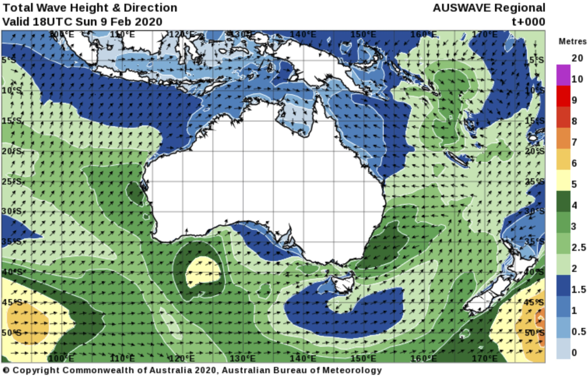
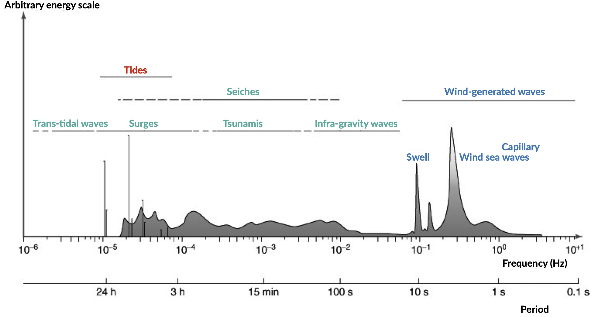
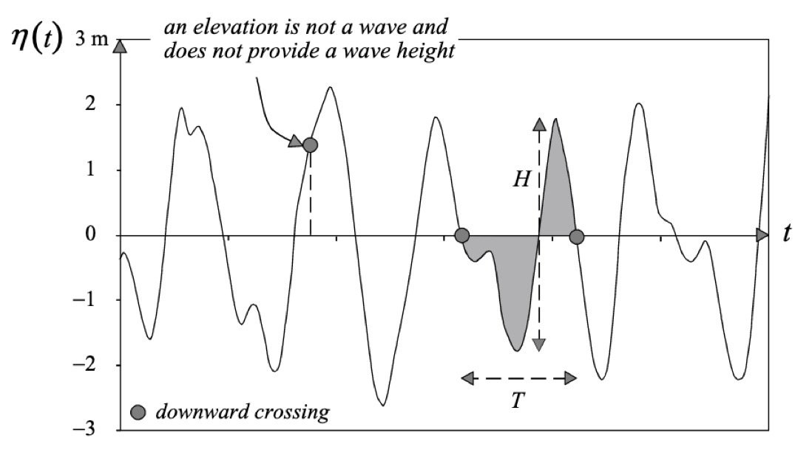
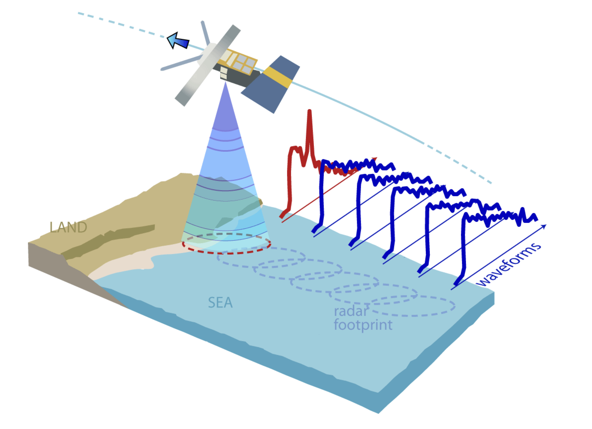
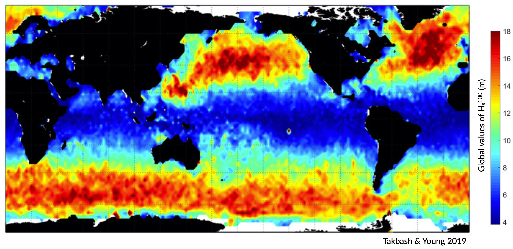
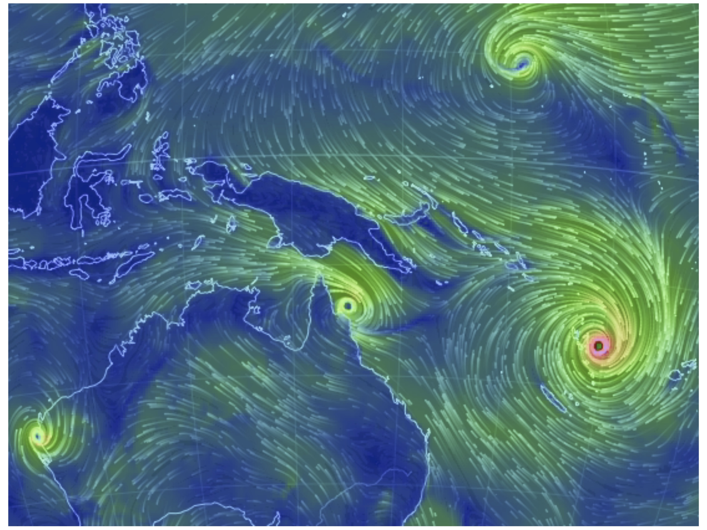
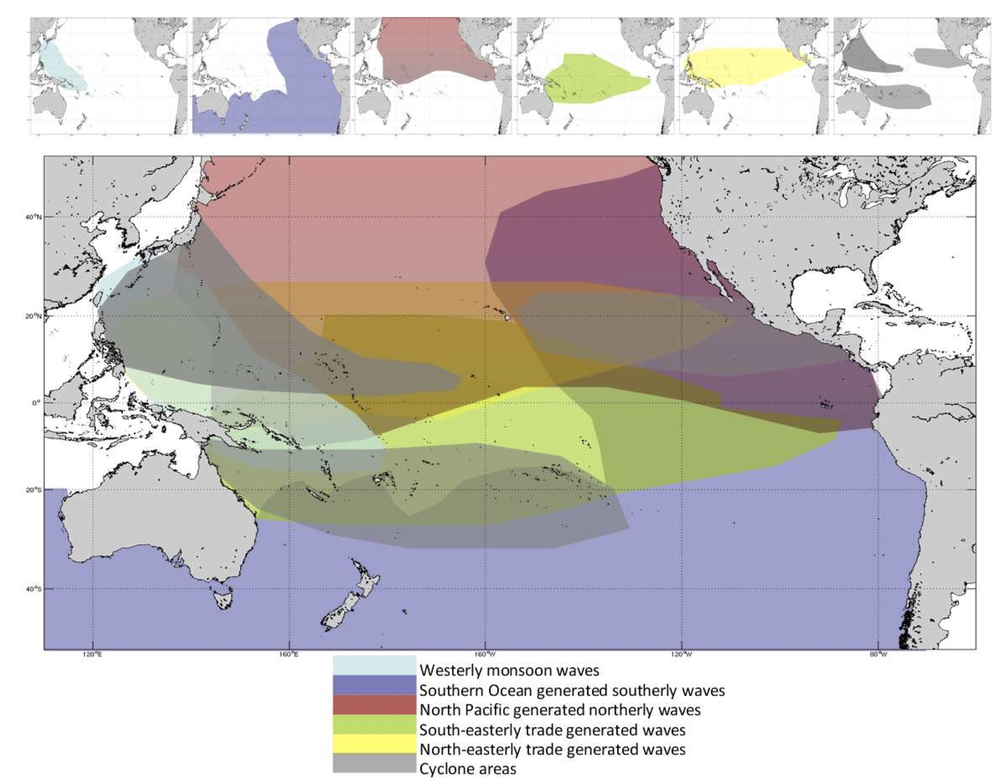

Wave climate
=================

Waves are a defining characteristic of water-bodies worldwide, transporting energy that impacts numerous physical and ecological processes. Since World War II, there has been a substantial increase in scientific understanding of wave formation, propagation and resulting impacts on coastal and marine features.

Initial wave studies were restricted to data from voluntary ship observations, which were limited in accuracy and sample size, particularly during extreme conditions. The development of technology such as wave buoys has provided accurate, hourly data of wave height, period and direction. This data enables almost immediate knowledge of the **sea state**, which is the present wave conditions.

.. note::
  In Australia, waves have been officially recorded since 1974 with the deployment of the first Waverider buoy in Port Kembla, New South Wales (`Hemer et al. 2007 <https://www.jstor.org/stable/26481627?seq=2#metadata_info_tab_contents>`_). This was the start of an increasing network of *buoys*, *High-Frequency radars* and other wave measurement technology leading to significant knowledge of wave dynamics around the Australian coastline. A further technological leap in wave monitoring was achieved in 1985, with the launch of the `GEOSAT <https://earth.esa.int/web/eoportal/satellite-missions/g/geosat>`_ satellites with a mounted *altimeter*. As a remote sensing technique, altimeters provide wave data observations with unparalleled spatial and temporal resolution (`Ribal & Young 2019 <https://www.nature.com/articles/s41597-019-0083-9>`_). Long-term analysis of wave conditions can lead to the characterisation of a wave climate, which is the modal wave conditions of an area (`Godoi et al. 2016 <https://agupubs.onlinelibrary.wiley.com/doi/pdf/10.1002/2015JC011572>`_).

Variation from the modal wave climate can occur due to *extreme events* such as large **storms**, **Tropical Cyclones** (TC) or **tsunamis**. For Australia, it is critical to understand these extreme conditions and to analyse their role in ecological disturbance, as well as to predict present and future vulnerability, particularly with anthropogenic climate change likely to increase the frequency of intense TCs along our coasts.

The wave climate of a region is further impacted by **climate oscillations**, which are semi-regular cyclical changes that have well-defined effects on regional and global weather patterns. These fluctuations typically influence atmospheric temperature, sea surface temperature, wind or precipitation. Oscillations operate on different timescales and can therefore occur together, enhancing or diminishing the effects of each event (`Godoi et al. 2019 <https://rmets.onlinelibrary.wiley.com/doi/full/10.1002/joc.5823>`_). A key example is the El Nino-Southern Oscillation (**ENSO**), which plays an integral role in climate modulation over the Pacific Ocean and surrounding continents. Both the Australian modal and extreme wave climates can be substantially influenced by these climate oscillations, primarily due to changes in wind patterns and changes to extreme event frequency and intensity.

Wave formation
-----------

Ocean waves are formed by several different mechanisms and as a result, can have a wide range of properties. In this course, we focus on **ocean surface gravity waves** (henceforth referred to as waves), also known as *wind-generated waves*.

.. important::
  At the atmosphere-ocean interface, kinetic wind energy is transferred to the ocean, which with sufficient wind, generate waves (`Holthuijsen 2007 <https://www.cambridge.org/core/books/waves-in-oceanic-and-coastal-waters/F6BF070B00266943B0ABAFEAE6F54465>`_). Several factors influence wave formation, including the *strength* and *duration* of the wind, and the *fetch*, the distance over open ocean which the wind blows.

When wind blows over only a short distance, wind-waves are formed. In Australia, these locally-generated waves typically have a short period of **1-8 s**, and travel slower than the prevailing wind. In contrast, swell-waves are generated by distant storms and have propagated out of the wave-generation area. Swell has a longer period of **8-30 s**, and is only minimally influenced by local wind conditions. In many instances, these two wave types occur simultaneously and can travel in opposite directions, creating chaotic seas.

Wave Parameters
*****

Waves can be characterised by parameters such as *wave period*, *height*, *power* and *direction*. Distinctions between different wave classes are based on these measurements and are used to describe both individual waves and the wave climate of a region.

The vertical distance between the maximum and minimum surface elevation over one wave period is referred to as **wave height** (`Holthuijsen 2007 <https://www.cambridge.org/core/books/waves-in-oceanic-and-coastal-waters/F6BF070B00266943B0ABAFEAE6F54465>`_). To define the overall wave height of many waves, typically the significant wave height is calculated (:math:`H_{s}`). Mathematically, :math:`H_{s}` is the mean of the highest third of waves in a given sample period (`Holthuijsen 2007 <https://www.cambridge.org/core/books/waves-in-oceanic-and-coastal-waters/F6BF070B00266943B0ABAFEAE6F54465>`_); traditionally, it is the height a trained observer would see when attempting to estimate average wave height, as humans would not see or consider the smallest waves.

**Wave period** is the time for one full wavelength to pass a given point, from the beginning to the end of the wave (`Holthuijsen 2007 <https://www.cambridge.org/core/books/waves-in-oceanic-and-coastal-waters/F6BF070B00266943B0ABAFEAE6F54465>`_).
Usually, the zero-crossing period is used (:math:`T_{z}`) that measures the time for a wave to go below the mean elevation, rise above, then return to mean elevation.

As waves propagate across the ocean surface, energy is also transferred, referred to as **wave power** (:math:`P`) or **wave energy flux**. The :math:`P` of each wave is proportional to the :math:`T_{z}` and the square of :math:`H_{s}`, with higher values producing more powerful waves (Airy 1841). This parameter is important as it combines both :math:`H_{s}` and :math:`T_{z}`, providing an overall understanding of the wave conditions and the energy it transports. For example, a wave with a :math:`H_{s}` of 1 m and :math:`T_{z}` of 5 s will have less power than a wave with an :math:`H_{s}` of 1m and :math:`T_{z}` of 8s.

**Propagation direction** (:math:`\theta`) is the direction from which waves are coming from. In certain regions a particular wave direction can indicate different swell characteristics, for example, large waves from the South-East in Queensland, Australia, indicate strong Southern Ocean swell or Extra-Tropical Cyclone swell, whilst large waves from the north indicate Tropical Cyclone waves.

Characterising wave climate
-----------

The modal wave climate of a region is determined through a long-term analysis of several wave parameters, including :math:`H_{s}`, :math:`T_{z}`, :math:`P` and :math:`\theta` (`Holthuijsen 2007 <https://www.cambridge.org/core/books/waves-in-oceanic-and-coastal-waters/F6BF070B00266943B0ABAFEAE6F54465>`_).

.. image:: images/waveclimate.jpg
   :scale: 35 %
   :alt: Wave climate analysis
   :align: center

There are numerous techniques that can be used to measure these parameters. However, most methods do not measure all parameters: a deliberate choice must be made, with consideration to the advantages and disadvantages of each technique. Frequently, the method chosen is customarily calibrated with other techniques or used in combination.
Common methods include:

* wave buoys,
* wave hindcast models and
* satellite altimeters.

Wave buoys
*****

Wave buoy data is routinely considered ground truth, as it is a physical measurement of individual waves instead of remote sensing (`Hemer et al. 2007 <https://www.jstor.org/stable/26481627?seq=2#metadata_info_tab_contents>`_). Buoys also provide the most reliable and accurate records, particularly for extreme values. Despite this, variations in sampling, calibration and computational methods can lead to significant errors by both over and under-estimating wave parameters.

.. note::
  `Bender et al. (2010) <https://journals.ametsoc.org/doi/full/10.1175/2010JTECHO724.1>`_ revealed buoys can overestimate :math:`H_{s}` by 26%, and overestimate during hurricane peak by up to 56%, leading to significant and highly misleading errors.

Buoys are also spatially limited, measuring only waves that propagate directly through the site, leading to a restricted understanding of regional wave climates. Furthermore, many locations do not have buoys in operation, thereby inhibiting the analysis of wave climate through buoys alone.

Wave hindcast models
*****

Wave hindcast models use **reanalysed wind fields** to investigate **past** waves. Wind speed and duration are required parameters that are calculated alongside fetch and water depth to determine :math:`H_{s}`, :math:`T_{z}` and :math:`\theta`. This provides data sets that are used globally to establish wave climate and can evaluate conditions at different temporal and spatial scales.

.. tip::
  A widely used wave hindcast is the *National Oceanic and Atmospheric Administration* (NOAA) **WaveWatch III model** (`Tolman 2009 <https://polar.ncep.noaa.gov/mmab/papers/tn276/MMAB_276.pdf>`_).

.. raw:: html

    

    <iframe width="100%" height="550" src="https://www.youtube.com/embed/xmQs-gAYKJo?rel=0" frameborder="0" allow="accelerometer; autoplay; encrypted-media; gyroscope; picture-in-picture" allowfullscreen></iframe>
    

However, significant problems can arise through error with forced wind condition. For example, extreme events such as TCs can cause abrupt, localised changes to wind speed and direction. Since models such as **WaveWatch III** have relatively coarse spatial-temporal resolution, insufficient energy from wind is inputted leading to significant underestimation of wave conditions during these extreme events. The accuracy of the hindcast model is also dependent of additional source term parameters and generation, propagation and dissipation equations.

.. note::
  In Australia, this is a significant problem in reef areas, where wave propagation is modified substantially by reefs. With coarse spatial detail, identification and accounting for reefs are reduced, thus leading to potentially incorrect wave conditions in areas sheltered by reefs.

Therefore, whilst wave hindcast models can provide excellent information of wave conditions, particularly in areas where there are no buoys, inherent limitations regarding spatial detail and reliance on source terms means that it is currently unsuitable for wave climate characterisation for reef or areas with complicated bathymetry.

Wave-sensing technology
*****

A remarkable wave-sensing technology with high spatial-temporal density is the radar altimeter, widely established as a pinnacle remote sensing technique to determine wave climates globally (`Ribal & Young 2019 <https://www.nature.com/articles/s41597-019-0083-9>`_).

Radar altimeters are mounted on satellites and measure a footprint of the ocean directly under the satellite, between 5-7 km wide. When the water surface is calm and flat, the reflection of the radar pulse back to the altimeter is almost instantaneous. In contrast, when waves are present the pulse is first reflected at the crest of the wave, then progressively reflected as the pulse reaches the wave trough.

.. important::
  The altimeter interprets this signal to determine wave height and wind speed. Therefore, this remote sensing technique **does not provide individual wave statistics**, but rather **returns the average value over the footprint**, up to 7 km wide.

In comparison to a buoy, altimeters provide excellent spatial coverage, with observations along the ground track every second, approximately every 5-7 km. Since the launch of the first altimeter in 1985, (`GEOSAT <https://earth.esa.int/web/eoportal/satellite-missions/g/geosat>`_), altimeters have been used to determine wave climate. With the increased number of altimeters in orbit, the global coverage and temporal density are increasing, resulting in a technology highly suited to characterising wave climate, particularly in areas with no buoys, complicated bathymetry and in remote locations.

Wave period
*****

For waves that have been locally generated by wind, the local wind speed and wave height, both of which are accurately measured by altimeters, can be used to determine :math:`T_{z}`. More accurate results are achieved when the *wave age* is calculated first, which is the length of time wind has been acting on a wave.

First, the wave age is calculated through:

.. math::
   \epsilon = 3.25 \frac{H_{s} g}{U_{10}}

where :math:`H_{s}` is the significant wave height, :math:`g` the acceleration by gravity and :math:`U_{10}` the wind speed.

Wave age :math:`\epsilon` can then be used to estimate :math:`T_{z}`:

.. math::
   T_{z} = (((\epsilon - 5.78)/(\epsilon + (U_{10}/H_{s} \times (U_{10}/H_{s}) + H_{s}))))) +(H_{s} + 5.70))

Wave energy, group velocity & power
*****

Mean wave energy density (:math:`E`) (J/m2) is calculated by:

.. math::
   E = \frac{1}{8} \rho g H_{s}^{2}

with :math:`\rho` the density of seawater (set to 1027 kg/m3).

Wave group velocity (:math:`C_{g}`) in deep water conditions is approximated with:

.. math::
   C_{g} = \frac{g T_{z}}{2 \pi}

And wave power :math:`P` can, therefore, be estimated through:

.. math::
   P = E C_{g}

which is the wave energy flux per metre of wave-crest (W/m). This is then converted into kW/m for ease of analysis.

Extreme wave climate
-----------

Globally, extreme waves are generated by:

* cyclones,
* tsunamis,
* rogue waves and
* large storms.

Above figure depicts the estimated 1-in-100 year significant wave height globally, with larger waves predominate in the higher latitudes due to extended fetch and frequent storms, whilst equatorial regions experience smaller extreme waves (`Takbash & Young 2011 <https://journals.ametsoc.org/doi/pdf/10.1175/JCLI-D-19-0255.1>`_).

Cyclones are a broad category of weather systems that can cause extreme waves, characterised by strong winds around a low pressure centre. TCs are formed over tropical or sub-tropical regions, whilst Extra-Tropical Cyclones form in the mid- or high-latitudes.

.. note::
  East Coast Lows (ECL) are one such Extra-Tropical Cyclone that is generated near southeastern Australia, from either tropical or mid-latitude controls (`Dowdy et al. 2019 <https://link.springer.com/article/10.1007/s00382-019-04836-8>`_).

TC are low pressure systems that periodically develop over warm oceans. Sea surface temperature is a key driver of TCs, with a positive temperature anomaly leading to increased intensity and kinetic energy of the TC, as well as enhanced storm surges.

Strong winds and heavy rain can extend hundreds of kilometres from TC centres, and can last from days to weeks. The consequent destructive wind, rainfall, waves and storm surges are highly dangerous, causing extensive risk to life and millions of dollars in property damage. For example, severe TC Justin caused the death of over thirty people due to storm surges and large waves (source: *Bureau of Meteorology*).

TCs are major drivers of coral reef disturbance and destruction, with reefs close to a cyclone experiencing a decrease in hard coral cover, taxonomic richness and coral density that can last for decades. Lagoon flooding, increased sediment load, decrease in local salinity and pH levels are further impacts which negatively affect coral growth and recovery.

.. note::
  Along with severe storms, cyclone waves are key producers of coral rubble. Together with carbonate sand, coral rubble constitutes the majority of reef volume. Over time and subsequent extreme events, the coral rubble progrades and can form rubble spits and islands. Despite the catastrophic nature of these impacts, TC are spatially bound, and thus reefs will typically go a number of years before another major disturbance tracks through the same area.

.. image:: images/yasi.jpg
  :scale: 45 %
  :alt: Coral reef damage in the Great Barrier Reef following Tropical Cyclone Yasi. Source: Beeden et al. (2015)
  :align: center

ECLs are a different type of cyclone that has significant effects on the Eastern Australian coastline. Formed by a temperature gradient between cold air in the upper atmosphere and warm Tasman Sea air, ECLs generate extreme winds, precipitation and large waves (`Dowdy et al. 2019 <https://link.springer.com/article/10.1007/s00382-019-04836-8>`_). They typically develop in the winter months close to the New South Wales coast, however, impacts can spread to southern Queensland and Victoria. Whilst typically not as severe as TCs, gusts over 170 km/hr and waves of over 14 m have been recorded, resulting in dangerous maritime conditions and coastal destruction.

Wave climate variability
-----------

Various meteorologically driven changes in atmosphere-ocean coupling can substantially alter surface wind fields and, as a result, influence wave climate on both regional and ocean basin scales (`Godoi et al. 2016 <https://agupubs.onlinelibrary.wiley.com/doi/pdf/10.1002/2015JC011572>`_).

Many studies have shown that the Pacific Ocean wave climate is altered by the **El Nino Southern Oscillation** (ENSO) and the **Southern Annular Mode** (SAM), however, the response to these can be variable in both space and time. Several regions, including islands in the Pacific, are projected to be more at risk from a changing wave climate than risks from sea level (`Hemer et al. 2011 <https://www.environment.gov.au/system/files/pages/275228c5-24db-47f2-bf41-82ef42cda73d/files/wind-wave-report.pdf>`_). Thus, an understanding of the current variability of the wave climate is an important step to understanding the influence of global climate processes and potential links to climate change (`Godoi et al. 2018 <https://rmets.onlinelibrary.wiley.com/doi/full/10.1002/joc.5823>`_).

Seasonal changes
*****

Along eastern Australia, the strength of south-east trade winds fluctuate throughout the year and occur predominantly during the austral winter during *April-October* (dry season). From *November-March* (wet season) the trade winds lessen and can even reverse, linked to the Australian Monsoon and the location of the **Intertropical Convergence Zone** (ITCZ) (`Hemer et al. 2007 <https://www.jstor.org/stable/26481627?seq=2#metadata_info_tab_contents>`_). During the wet season, the ITCZ moves closer to Australia, decreasing the strength of trade winds. Periodically, increased strength north-west winds occur due to the presence of the Australian Monsoon. This could have a significant impact on wave climate, with **decreased modal wave heights** during the wet season, however with **small periods of higher waves** due to intense storm and precipitation events during monsoons.

Long-term trends
*****

Several regions of the global ocean have statistically significant positive and nega- tive trends in Hs (Figure 2.10). An analysis of 33 years of altimeter data by Young & Ribal (2019) determined that extreme 90th percentile waves in the Southern Ocean are increasing by 1 cm/year, and in the North Atlantic by 0.8 cm/year (Figure 2.10). This is correlated to an increase in extreme wind strength in the region (Young & Ribal 2019). Despite mean local wind speed increasing glob- ally, the mean Hs show less explicit trends in all regions. Several areas, such as the Southern Ocean, have a slight positive increase of 0.3 cm/year, whilst other regions have slight negative trends (Figure 2.10). This implies that upper percentile trends are increasing faster than mean trends. Many regions, such as Southern Australia, can be dominated by swell rather than local wind sea (Hemer et al. 2017), and therefore increases in mean local wind speed may not have direct effects on the local wave climate. Instead, increasing wind speed in the higher latitudes may increase swell size, which propagates into the middle latitudes (Young et al. 2011). Consequently, long-term decadal trends in wave height are occurring at different rates around the globe, with mean and extreme waves exhibiting different behaviours.

Climate oscillations
*****

The ENSO phenomenon is the largest and most influential mode of climate varia- tion that operates on a seasonal-to-interannual timescale (Stopa & Cheung 2014,Timmermann et al. 2018). It is a complex ocean-air coupling in the equatorial region of the Central and Eastern Pacific Ocean that has significant influence over global climate (Barnard et al. 2017). The positive La Nin ̃a phase leads to reduced atmospheric convection over the Pacific Ocean, causing increased precipitation, a greater number of TCs, and cooler maximum temperatures in Australia (Jin et al. 2014). There are stronger than normal trade winds, which could lead to larger wave heights (Hemer et al. 2011). In contrast, the negative El Nin ̃o phase leads to a shift in atmospheric circulation, with a weakening or reversal of the dominant south-easterly trade winds and decreased frequency of TC for Australia (Timmermann et al. 2018).

There is a substantial connection between the two ENSO extreme phases to inter-annual wave height and direction variability, with significantly different im- pacts around the Pacific Basin (Figure 2.11) (Hemer et al. 2011). This typically results in atypical coastal erosion around the Pacific Ocean basin, with different locations experiencing diverse effects (Barnard et al. 2015). For example, the West Coast of the United States experiences an increase in winter wave energy during El Nin ̃o phases, leading to substantial beach erosion and coastal flooding (Barnard et al. 2017). This area experiences a more dominant southerly wave direction during the El Nin ̃o phase, which drives abnormal erosion in beaches normally protected from severe swell. In contrast, the La Nin ̃a phase is linked to higher wave energy on the Eastern Australian coastline and more extreme storms (Barnard et al. 2015, McSweeney & Shulmeister 2018, Shand et al. 2010). In New Zealand, increased Hs occurs during both of the ENSO extreme phases, resulting in increased coastal and marine operational risk alongside potential changes to biological and physical marine processes (Godoi et al. 2016). Climate change is predicted to bring more frequent and extreme ENSO events of both phases, which could lead to atypical wave conditions (Cai et al. 2015). Therefore, it is imper- ative to understand the historical impacts of ENSO on wave climate to predict the future conditions for marine and coastal vulnerability globally.

The SAM, also known as the Antarctic Oscillation, is the principal mode of variability in the Southern Hemisphere extratropics and high latitudes (Marshall et al. 2018). The SAM controls the north and south movement of the westerly wind belt that circulates Antarctica and is measured by the difference in zonal mean sea level pressure between 40◦S and 65◦S. During the positive phase, the wind belt contracts towards Antarctica and is often correlated to stable, dry con- ditions in Australia. In the negative phase, the belt expands north and can lead to increased storm frequency and precipitation in Australia and New Zealand (Godoi et al. 2016). SAM phases can significantly influence wave height and di- rectional variability, as shown in Figure 2.11, influencing the entire Pacific Ocean basin.

Thus, climate oscillations can significantly modulate the wave climate around the globe, leading to diverse effects in different regions. Oscillations can also enhance or detract the effects of other oscillations, as noted by (Godoi et al. 2018, Hemer et al. 2011), leading to complex interactions and influence on both atmospheric and wave climate. A long-term dataset is required to adequately determine the degree of modulation by each climate oscillation, in addition to high spatial resolution to establish differences in modulation between geographical areas.
